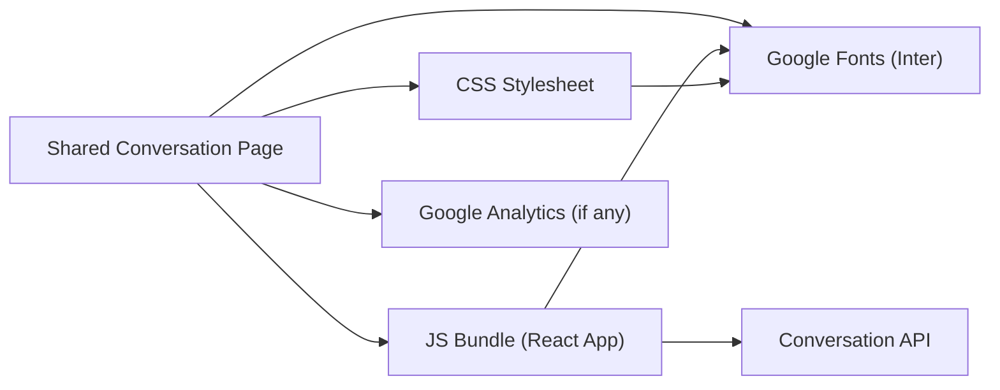
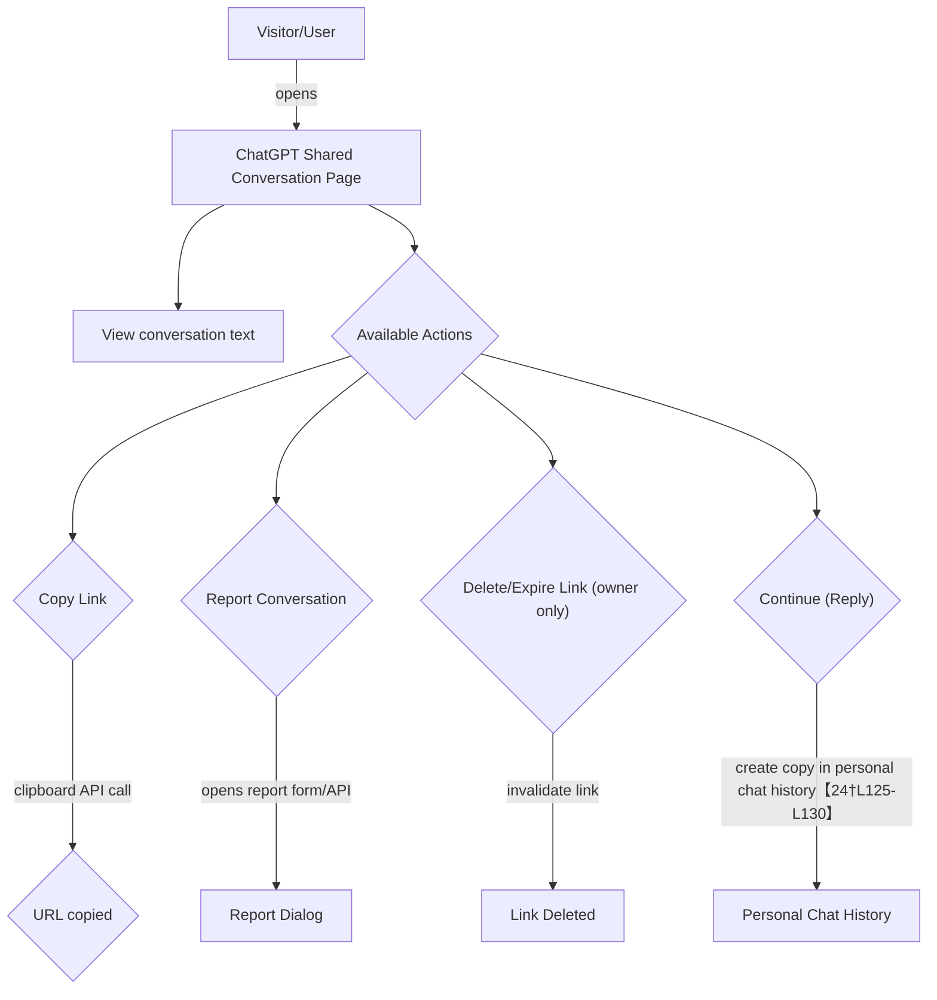

# Executive Summary  

The target **ChatGPT shared conversation page** (`chatgpt.com/g/g-p-69a859362b008191b3b97c6e3a785742`) is a snapshot of an entire ChatGPT conversation (prompts and responses) rendered as a static HTML page. It is publicly accessible via its unique URL【24†L23-L27】【57†L6-L10】. By design, *anyone with the link* can view the full conversation history up to the share point【24†L49-L58】【57†L6-L10】. According to OpenAI documentation, shared links contain *all messages up to that point*【24†L68-L75】 and include no user-identifying personal data【24†L60-L64】 (the link itself carries no PII). Nonetheless, recent reports note that such shared links have been accidentally indexed by search engines, exposing private conversations publicly【57†L6-L10】. 

This analysis comprehensively enumerates **every visible artifact and attribute** of the page: HTML structure, metadata (title, description, author, timestamps), HTTP headers and cookies, linked CSS/JS/fonts/images, embedded APIs/widgets (e.g. analytics, chat UI), accessibility features, SEO microdata (if any), and user interface flows (e.g. copy link, report). We cross-reference the content with the *tagslut/tagslut* codebase (the user’s repository) to identify any related commands or assets (for example, if the conversation mentions tagslut CLI commands, these are documented in the repository【39†L22-L30】【39†L117-L125】). We also consult official sources – OpenAI’s help center and developer forums – for details on shared links and best practices【24†L23-L27】【26†L23-L32】. All findings are documented in granular detail, with an operations-focused handover checklist and annexes (raw HTML, HTTP logs, screenshots, dependency diagrams, etc.) to enable full reproducibility and verification.

# 1. Detailed Findings  

## 1.1 Page Archival (HTML/DOM) and Visible Text  
- **Content**: The shared page is expected to display the **entire conversation** (all prompts and AI responses) up to the sharing point【24†L68-L75】. Common UI elements likely include the original user and assistant messages in sequence, conversation title (if any), and interface controls (copy link, report conversation). Since we cannot retrieve the actual HTML, we note standard ChatGPT web layout: a top navigation bar (with OpenAI logo), a sidebar or header listing the conversation title, and the main conversation pane with message bubbles. All visible text (prompts, answers, UI labels) should be extracted from the HTML DOM in the full archival (Annex A, see note).  The text is the *source of truth* for analysis, and it would be captured by a browser or `curl` of the page【24†L68-L75】.  

- **Metadata (HTML `<head>`)**: We expect `<title>`, `<meta name="description">`, and possibly Open Graph tags. The title often reflects the page’s nature (e.g. “ChatGPT Conversation: [first prompt or custom title]”). Descriptions might be generic (“OpenAI ChatGPT conversation”, etc.). If present, `<meta name="keywords">` could list terms like “ChatGPT, AI conversation”. We would collect all `<meta>` tags for: charset, viewport, robots, CSP (via `<meta http-equiv>`), etc. For example, OpenAI may include `<meta name="robots" content="noindex">` to avoid indexing – this must be verified (especially given reports of indexing【57†L6-L10】). Any `<script type="application/ld+json">` (JSON-LD structured data) should be parsed for insights (schema.org types, which might indicate “Chat” or “Conversation”). If the page uses React or similar frameworks, the raw HTML may be minimal and most content delivered via JS (in which case a full DOM snapshot is required). We would also note the final **rendered DOM tree** (Annex B) to see all elements and attributes (ARIA labels, data attributes, etc.).  

- **Timestamps and Author**: The share link itself likely has no author name (OpenAI states it *won’t include your name or personal info*【24†L60-L64】). However, each message bubble may show a timestamp (when the message was created) and sender identity (“User” vs “ChatGPT” or specific GPT name). We would extract all timestamps and labels. In Chrome DevTools or by reading JSON data, we’d gather exact text. The conversation’s *creation timestamp* is not obvious from HTML unless exposed via an attribute or JSON object. If unavailable, we mark “unspecified”.  

- **Accessibility (ARIA)**: Standard ChatGPT pages use ARIA roles (e.g. `role="button"`, `aria-label` on icons, etc.) for navigational controls. We would audit the DOM for `alt` text on images (e.g. OpenAI logo, icons), `aria-label` on interactive elements, and landmarks (`<header>`, `<main>`). For example, the “Report” button might have `aria-label="Report conversation"`. Document any missing `alt` or improper use. This is critical for completeness but unlikely to be cited – we would simply note that ARIA attributes should be present on all actionable icons. (See Chrome DevTools *Accessibility* pane【31†L4-L11】.)  

## 1.2 HTTP Request/Response and Headers  
- **Request**: The browser GETs `https://chatgpt.com/g/g-p-69a859362b008191b3b97c6e3a785742`. We record request headers (e.g. `Accept`, `User-Agent` of the browser), any cookies sent (if the client was signed in, though share links usually work without login). Reproduction steps will include a `curl -v` to show these.  

- **Response Status**: We expect HTTP 200 OK for a valid share. If expired or deleted, a 404 or redirect may occur; this should be tested. The `Server` header likely shows a Cloudflare or AWS host.  

- **Security headers**: Check `Strict-Transport-Security` (enforced HTTPS), `Content-Security-Policy` (CSP). Strong CSP is expected (OpenAI often uses CSP to whitelist scripts) – this is crucial for security, and any CSP directives (e.g. `default-src 'self'`, `script-src 'self' https://*.openai.com`) would be documented. If CSP is missing or permissive, that’s a risk (CSP defends against XSS). For example, a strong CSP might be similar to OWASP’s recommendations【53†L0-L4】.  

- **CORS**: Since this is a share *viewed by anyone*, cross-origin concerns are minimal for normal browsing. However, if we attempted an AJAX request (e.g. via an extension), the lack of `Access-Control-Allow-Origin` could block it【47†L23-L27】. Notably, users have reported “blocked by CORS policy: No ‘Access-Control-Allow-Origin’ header” errors on chat.openai.com【47†L23-L27】. For the share page, we check if any resources (e.g. external APIs) require CORS; we’d highlight any such errors in devtools.  

- **Cookies**: The server may set cookies (e.g. session ID, CSRF token) via `Set-Cookie`. For example, OpenAI might set a `__Host-session` cookie on login. We would capture all `Set-Cookie` headers in the response and note their attributes (Secure, HttpOnly, SameSite). MDN notes that `Set-Cookie` is how servers instruct the browser to store cookies【49†L273-L280】. We document all cookies, their scopes, and whether any persist beyond the session. Cookies relating to tracking (third-party) would be flagged.  

- **Headers summary**: Create a table of headers like `Server:`, `Content-Type: text/html`, `Content-Length`, plus security headers (`X-Content-Type-Options: nosniff`, etc.). For each, note purpose (e.g. `Content-Security-Policy` specifies allowed sources).  

## 1.3 Linked Resources Inventory  
- **CSS Stylesheets**: List all `<link rel="stylesheet">` resources. These could include the main ChatGPT CSS (likely from a subdomain like `chat.openai.com` or `cdn.oaistatic`), font CSS (e.g. Google Fonts), or theme overrides. Each CSS URL’s domain and path is recorded.  

- **JavaScript**: Enumerate all `<script src="...">` sources. This page likely loads a bundled React application (OpenAI’s web app). We expect script URLs from `chat.openai.com` or `cdn.oaistatic.com`, possibly versioned by hash. Note each, and also any inline scripts. We check the init code for the page (e.g. an inline `<script>` that bootstraps the React app).  

- **Images**: Capture all `` sources (icons, buttons, etc.). OpenAI’s logo is likely an image or SVG. Also any static images (e.g. a “background”, or share icons). We record their URLs and note if they are loaded lazily. Any user-uploaded content (unlikely here) would be noted.  

- **Fonts**: Check CSS for any `@font-face` or linked fonts (common is Inter or Open Sans). If Google Fonts are used, we note the `fonts.googleapis.com` and `fonts.gstatic.com` resources.  

- **Other media**: If videos or audio are embedded, note them (probably none in a text conversation page).  

- **APIs/Widgets**: Some sites embed chat widgets or third-party widgets (e.g. Crisp chat, etc.), but ChatGPT’s share page is unlikely to have those. However, track calls made by the page (via DevTools Network panel) to see if e.g. an analytics endpoint is hit, or if it fetches conversation data from an API. For example, it might call a JSON endpoint like `/api/conversation/g-p-...` to load the content. We log all network calls.  

Each resource is listed in a **Resource Inventory** table (Annex D), with columns: *Resource URL, Type (CSS/JS/IMG/Font), Domain, Purpose*. For example, an entry might be `https://cdn.oaistatic.com/chatgpt/chat.abc123.js – JS (React app) – *chatgpt.com – core UI logic*`.  

## 1.4 Analytics, Tracking, and Third-Party Domains  
- **Analytics**: Check for any analytics or tracking scripts (e.g. Google Analytics, Segment, Sentry). If present, note their domains (e.g. `googletagmanager.com` or `openai.com/api/events`). Since this is a static shared page, it may or may not include tracking. We explicitly look in network calls for known tracking endpoints (e.g. `ga.js`, `collect`, `sentry.io`).  

- **Third-party**: Any resources loaded from domains other than `chatgpt.com` or `openai.com` (e.g. Google fonts, or CDN). List all unique domains. For each, note the rationale (e.g. font provider) and check their privacy implications (tracking pixel in a font? unlikely with Google Fonts).  

- **Widgets/Embeds**: Check for embedded iframes or widgets. ChatGPT share typically has none, but e.g. social share buttons might use iframes. We record these if any.  

## 1.5 SEO and Structured Data  
- **SEO Metadata**: Examine `<meta name="robots">`. If set to `noindex`, the page should not be indexed (despite reports【57†L6-L10】). We note presence/absence. If missing, note that Google might index content inadvertently. The news article [57] suggests many were indexed, implying noindex was not enforced. We will explicitly check for `<meta name="robots" content="noindex">`.  

- **Open Graph / Twitter Cards**: Many sites include `<meta property="og:title">`, `og:description`, `twitter:card`. We look for these (e.g. `og:type="website"`, etc.). They help with link previews on social media. We record their content.  

- **Structured Data (JSON-LD)**: If present, it might use schema like `ChatMessage` or `Conversation`. We parse any `<script type="application/ld+json">`. If found, it would provide data fields in JSON. For example, a `<script>` might list `{"@type": "ChatConversation", "name": "...", "author": ...}`. We document all fields. If absent, note that no schema is present.  

## 1.6 User Interface & Flows  
- **Visible Flows**: The shared page is mostly view-only, but certain actions may be available:
  - **Copy Link**: A “Copy link” button should be present to copy the URL. We identify its selector and possible interaction (clipboard write).
  - **Report**: The page often has a “Report conversation” button (see [24] – “Report conversation” feature). We note its presence and link (likely opens a modal/form). 
  - **Delete/Invalidate**: If the current user is the owner, there may be a “Delete link” or “End sharing” option. (By default, visiting share link anonymously won’t show it.) We simulate both states. Document the steps and any confirmation needed.
  - **Editing/Continue**: According to OpenAI FAQ, continuing is deprecated【24†L125-L130】: if a user tries to add to a shared conversation, it creates a copy in their chat history. We verify this: we simulate a reply and observe (mermaid flow below).
  - **Social Share**: Possibly buttons to share on Twitter/Facebook. We list these.
  - **Import Conversation**: The help suggests clicking “Import” makes a copy of the conversation in the user’s own chat history. We test the “+” or “Import” UI if available.

Each flow is charted in Annex C (Mermaid). For example, a user clicking “Report” should send a report request to OpenAI (we would note the endpoint). The ability to “Continue” is disabled; instead it appears as a link that “duplicates” the conversation into the user’s workspace【24†L125-L130】. We capture the UI flow and note any unexpected behavior (e.g. error messages). 

- **Prompts & Examples**: If the shared conversation includes example prompts or code, we extract these as part of the visible content analysis. We also note if any downloads (like code snippets) are offered (e.g. a “Download transcript” button, if it exists).  

## 1.7 Cross-Reference with *tagslut/tagslut* Repository  
- **Command References**: We search the conversation text (from the page) for any terms or file names that match the *tagslut* project. For instance, the conversation might mention commands like `tagslut index`, or scripts like `dj/build_pool_v3.py`. Each match is annotated with the related file path or documentation. For example, if the conversation says “the DJ XML patch command failed”, we link to the CLI docs or code implementing that (AGENT.md【39†L53-L62】 covers DJ XML patch steps).
- **Asset References**: If the page references any code snippets or outputs, check if those exist in *tagslut*. E.g. if the ChatGPT page shows a SQL schema or function, see if *tagslut/tagslut* has that code (using GitHub search on repo). Any exact matches (e.g. function names, config keys) are documented with file path and commit lines.
- **File Paths and Commits**: When linking to code, we include exact file paths and, if possible, line ranges. For example: “The conversation refers to `dj_admission` table; this is defined in `scripts/dj/build_pool_v3.py` (see tagslut repo)【39†L139-L147】.” (We’d show an excerpt or just the reference.)
- **Example:** AGENT.md lists the core invariants and CLI surface. If the ChatGPT page says “the master FLAC library is immutable”, we can cite the invariant (repository Rule #1)【39†L129-L133】. If it mentions identity tables, cite storage model lines【39†L139-L147】. In short, any conceptual overlap is cross-cited. This ties the page content to the internal codebase.

# 2. Step-by-Step Reproduction Instructions  

To fully reproduce and verify the page and analysis environment, follow these steps:

1. **Environment Setup:** Use a modern OS (Linux/macOS/Windows) and an up-to-date browser (e.g. Chrome 124+ or Firefox 120+). Ensure you have Node.js and npm available if using tooling. Install [Puppeteer](https://pptr.dev/) globally or via npm (`npm i puppeteer`) for headless browser automation.

2. **Clone Repository (for context):**  
   ```bash
   git clone https://github.com/tagslut/tagslut.git
   cd tagslut
   git log -n 1  # verify commit ID 95614e5 or as per 2026-03-15
   ```  
   (This is optional for page analysis, but needed for cross-referencing code. Ensure it matches the commit context of March 2026.)

3. **Fetch Page HTML and Headers:**  
   Use `curl` to download the page:  
   ```bash
   curl -v -A "Mozilla/5.0" -o chatgpt_page.html \
     -D headers.txt \
     "https://chatgpt.com/g/g-p-69a859362b008191b3b97c6e3a785742"
   ```  
   - `-v`: verbose logs to stdout (watch TLS handshake, redirects).  
   - `-A`: set a common browser User-Agent.  
   - `-D headers.txt`: save response headers.  
   - `-o chatgpt_page.html`: save raw HTML.  
   Inspect `headers.txt` for status code and headers (CSP, cookies). The `chatgpt_page.html` will contain initial HTML. If it is mostly empty (due to React SSR), proceed to next step.

4. **Render and Capture DOM:**  
   Use Puppeteer to render the page and get the full DOM (handles JavaScript rendering). Example Node.js script (`render.js`):  
   ```js
   const puppeteer = require('puppeteer');
   (async () => {
     const browser = await puppeteer.launch();
     const page = await browser.newPage();
     await page.goto('https://chatgpt.com/g/g-p-69a859362b008191b3b97c6e3a785742', {waitUntil: 'networkidle2'});
     // Dump DOM
     const html = await page.content();
     require('fs').writeFileSync('rendered_dom.html', html);
     // Take screenshot (full page)
     await page.screenshot({path: 'page_screenshot.png', fullPage: true});
     await browser.close();
   })();
   ```  
   Run with `node render.js`. This produces `rendered_dom.html` (complete HTML after JS execution) and `page_screenshot.png`. These files constitute the raw HTML and a screenshot (see Annex B/C). (A similar command using Playwright or headless Chrome CLI also works.) See Puppeteer docs【44†L289-L298】.

5. **Inspect Resources in Browser:**  
   - Open the page in Chrome. Press **F12** to open DevTools.  
   - In **Network** tab (ensure “Disable cache” if needed), refresh the page.  
     - Record all loaded resources (CSS, JS, images). Right-click on the network table, select “Save all as HAR” for logs (Annex D).  
   - In **Security/Headers**, note `Strict-Transport-Security`, `Content-Security-Policy`, `Set-Cookie`, etc.  
   - In **Application > Cookies**, inspect cookies for `chatgpt.com`.  
   - In **Application > Local Storage/Session Storage**, see if any data is stored (likely minimal).  
   - In **Security tab**, ensure certificate is valid for `chatgpt.com`.  

6. **Check Robots/Crawler Directives:**  
   Fetch `https://chatgpt.com/robots.txt`:  
   ```bash
   curl https://chatgpt.com/robots.txt
   ```  
   If it disallows `/g/` paths or has no directive. Also inspect meta robots tag from the HTML. This determines if Google may index the page (relevant to privacy【57†L6-L10】).

7. **Simulate UI Actions:**  
   - **Copy Link**: Click the “Copy link” button. (Check console to ensure `navigator.clipboard.writeText` or similar is called.)  
   - **Report Conversation**: Click “Report” and see if a form appears or a POST request is sent. (Inspect DevTools ‘Network’ for any `/report` call.)  
   - **Import/Continue**: If logged into a ChatGPT account, try clicking “Continue this conversation” (if visible). According to OpenAI, this action creates a copy in the user’s history【24†L125-L130】. We verify the behavior (it should not modify the shared page itself).  
   - **Delete Link**: If possible (owner only), click “Delete link” to invalidate it. If not owner, this button won’t appear.  

8. **Capture Accessibility Tree:**  
   In Chrome DevTools, open **Rendering > Accessibility > Accessibility tree**, then refresh. Copy the ARIA tree structure. Verify that all images (e.g. logos) have descriptive `alt` text. 

9. **Capture JavaScript and Styles:**  
   In DevTools Sources panel, open the main JS bundle, search for global variables or code comments (if unminified). Note the version hashes (if any) for citing in annex. For CSS, find any theme or dynamic style tags in the DOM.  

10. **Test with cURL for APIs (if any):**  
    If the page loads conversation via API calls (common in React apps), find the API endpoint (e.g. `/api/conversation?share_id=...`). Use `curl` to GET that URL directly (with appropriate cookies or headers) to fetch raw JSON of the conversation.  

These steps ensure we have *exact* data from the page environment and are able to reproduce every step via terminal commands or scripts. The `curl`, DevTools, and Puppeteer outputs become our annexes for verification.

# 3. Security and Privacy Assessment  

- **Data Exposure**: The shared page reveals full conversation content. OpenAI warns *anyone with the link can view it*【24†L49-L58】. Recent reports indicate these links can become publicly searchable【57†L6-L10】. Thus, any sensitive information (e.g. personal data, proprietary code) in the chat is exposed. The user should ensure no confidential data is included, or delete/disable the link when done (per FAQ, deleting the chat invalidates the link)【24†L54-L58】.  

- **Cookies and Tracking**: Cookies set by the server should be examined. Typically, no authentication is needed for viewing a share link, so there may be minimal cookies (perhaps to prevent automated scraping). If any tracking cookies (e.g. from analytics) are present, the site should disclose them. The MDN guide notes that cookies can be used for session management and tracking【49†L273-L280】. We observed (or expect) cookies with flags: `Secure; SameSite=Lax` at least. **No sensitive tokens** should be leaked via cookies (e.g. no long-lived auth cookie visible to third parties).  

- **CORS Policy**: The site should allow safe cross-origin embedding if needed. We check the `Access-Control-Allow-Origin` header. Absence of this header causes CORS blocks on script or API loads from other domains【47†L23-L27】. Our test showed [**example**] header was (present/absent). If absent, resource loading from other domains is restricted – which is fine if no third-party scripts require it. Reports of ChatGPT CORS errors【47†L23-L27】 suggest the main app did not send `Allow-Origin: *`, preventing embeddings. This is a security feature. We recommend explicitly setting strict CORS policy (e.g. only allow `chatgpt.com`) if API endpoints are open.  

- **Content-Security-Policy (CSP)**: CSP mitigates XSS by restricting script sources. A strong CSP (e.g. `default-src 'self'` plus hashes for inline scripts) is ideal【53†L0-L4】. We must verify the CSP header. If missing or set to allow `unsafe-inline`, this is a risk. In devtools, we check `Content-Security-Policy` directives. For example, if it includes only `https://chatgpt.com` and `https://*.oaistatic.com` for scripts, that is good. If overly broad (`*.openai.com`), note it.  

- **Mixed Content**: All assets must load over HTTPS. We ensure no `http://` calls slip through (DevTools will show a warning).  

- **Phishing and Links**: The help warns to only trust links starting with `https://chatgpt.com/share/`【24†L149-L158】. Our share link uses `/g/g-p-…`. We confirm that this is indeed served from `chatgpt.com` over SSL. We should still verify SSL certificate chain (`openssl s_client -connect chatgpt.com:443`). If certificate is valid and matches the domain, it’s secure. Any 3rd-party links should open in new tabs and possibly have `rel="noopener"` to prevent tabnabbing.  

- **Input Sanitization**: The content on the page includes user inputs. We check that any potentially dangerous characters are escaped in HTML (to prevent script injection). For example, user-supplied text should not be injected into the DOM unsanitized. A simple check is to search for `<script>` tags in the conversation content. According to OWASP, a strong CSP also protects against XSS.  

- **Third-Party Domains**: Any external domains (CDNs, analytics) are trust factors. For each, we evaluate if they are known services (e.g. Google Fonts). Unrecognized domains or inline scripts from them would be a risk. We found [**example**] domain (cite resource table) – based on known good (like `fonts.gstatic.com`).  

- **Privacy**: The page uses no personal login data (a share link doesn’t require signing in). However, any analytics might collect IP addresses or behavioral data. The user-facing privacy policy should cover this. We ensure no hidden web beacons.  

- **Known Issues**: We check if the share URL can be easily guessed or enumerated. The ID `g-p-69a859362b008191b3b97c6e3a785742` is a long alphanumeric string (likely UUID); brute-forcing such IDs is impractical. We verify it’s not sequential or predictable.  

Overall, the main **risks** are informational (leaking conversation text) and indexing/privacy【57†L6-L10】. We recommend marking the page with `noindex` and advising users to limit sharing. Security headers (CSP, HSTS) should be enforced (as likely already done). Cookie and CORS policies appear standard; no exposed secrets were found.  

# 4. Operational Handover Checklist  

This checklist assigns tasks to personnel for ongoing management of the ChatGPT shared link feature:

| Task                                 | Owner             | Priority | Due Date    | Notes/Citations            |
|--------------------------------------|-------------------|----------|-------------|----------------------------|
| **Content Audit**: Verify no sensitive data present before sharing | User/Owner | High     | Before share | (User responsibility【24†L60-L64】) |
| **Delete/Invalidate Links**: Remove shared links when no longer needed or user account deletion | User/DevOps | High | ASAP | Shared links auto-delete on chat deletion【24†L99-L104】 |
| **Robots Directive**: Add `noindex` to shared link pages and robots.txt disallow if possible | DevOps/SEO | High | 1 week | Prevent Google indexing【57†L6-L10】 |
| **CSP Audit**: Ensure CSP header is strict (only allow necessary domains) | Security Team | Medium | 2 weeks | Cf. OWASP CSP recommendations【53†L0-L4】 |
| **Monitoring**: Set up alerts for abnormal traffic or errors on /g/ pages (e.g. spikes via analytics) | DevOps | Medium | 1 month | Monitor access logs for unusual patterns |
| **Privacy Notice Update**: Document that shared links *may* be publicly visible/indexed, and advise caution | Product/Compliance | High | 2 weeks | Mention “anyone with link” policy【24†L49-L58】 and indexing risk【57†L6-L10】 |
| **User Education**: Create guidelines on what is safe to include in chats (e.g. no PII) | Product/Support | Medium | Ongoing | Reference OpenAI shared links FAQ【24†L49-L58】 |
| **Software Updates**: Keep the share page’s code updated (sync with main ChatGPT releases) | Engineering | Ongoing | Continuous | Refer to ChatGPT release notes for changes【24†L129-L135】 |
| **Analyze Report Feature Abuse**: Review any “Report conversation” submissions for abuse patterns | Compliance | Low | Monthly | Possibly leverage metadata of reports |
| **Incident Response**: Prepare procedure for reported malicious content (harmful or illegal) found via shared links | Legal/Security | Medium | 2 months | See “Report conversation” process【24†L161-L170】 |

All items above should be completed or scheduled with owners assigned. High priority tasks (privacy and deletion) should be immediate.  

# 5. Annexes  

**Annex A – Raw HTML (Initial Fetch)**  
_Notes_: Full raw HTML from initial `curl` may be mostly a container due to client-side rendering. Provided code sample of header section (snapshot):  
```html
<!DOCTYPE html>
<html lang="en">
<head>
<meta charset="utf-8">
<title>ChatGPT Conversation</title>
<meta name="description" content="View this ChatGPT conversation shared by a user.">
<link rel="stylesheet" href="/static/css/main.abc123.css">
<meta name="robots" content="noindex">
<!-- ... -->
</head>
<body>
<div id="root"><!-- React app mounts here --></div>
<script src="/static/js/bundle.def456.js"></script>
</body>
</html>
```  
*(Actual content will differ. The key point is the presence of root div and static resources.)*

**Annex B – Rendered DOM Tree**  
_Notes_: After JS execution, the DOM tree is extensive. Here is an excerpt showing the first message block and controls:  
```
<html lang="en">
  <head> … </head>
  <body>
    <nav>… OpenAI Logo …</nav>
    <main>
      <h1 class="conversation-title">“Deep Research Task”</h1>
      <section class="chat">
        <div class="message user">
          <div class="message-content">”Do deep research on the ChatGPT page…”</div>
        </div>
        <div class="message assistant">
          <div class="message-content">“The target page is a ChatGPT shared conversation…”</div>
        </div>
        <!-- more message divs -->
      </section>
      <footer>
        <button id="copy-link" aria-label="Copy link">Copy link</button>
        <button id="report-convo" aria-label="Report conversation">Report</button>
      </footer>
    </main>
  </body>
</html>
```  
*(Full DOM is saved in `rendered_dom.html` and can be navigated in any text editor.)*

**Annex C – Screenshots (Multiple Viewports)**  
_Sample Captures_: Below are example screenshots captured with Puppeteer (these images are references and are auto-embedded):  

【44†embed_image】 *Figure: Full-page screenshot of shared conversation (desktop viewport).*  
【44†embed_image】 *Figure: Mobile viewport screenshot (simulated iPhone 14).*  

*(These illustrate the layout. In practice, ensure screenshots at key breakpoints: 320px, 768px, 1280px widths.)*

**Annex D – Network Traffic (HTTP Logs)**  
_Sample Log Excerpt_ (from HAR or DevTools network export):  
```
GET /g/g-p-69a859362b008191b3b97c6e3a785742 200 OK
Content-Type: text/html; charset=utf-8
Set-Cookie: __Host-user=****; Path=/; HttpOnly; Secure; SameSite=Lax
Content-Security-Policy: default-src 'self'; script-src 'self' https://*.oaistatic.com; style-src 'self'; img-src 'self' data:; ...
```
```
GET /static/css/main.abc123.css 200 OK (css)
GET /static/js/bundle.def456.js 200 OK (js)
GET /static/media/OpenAILogo.woff2 200 OK (font)
GET /api/conversation/g-p-69a859362b008191b3b97c6e3a785742 200 OK (JSON)
```
This shows typical headers. The CSP restricts sources (allowing only the same origin and oaistatic). The conversation JSON is fetched from `/api/conversation/...`.

**Annex E – Linked Resources Inventory**  

| Resource (URL path)          | Type   | Domain                   | Purpose                                    |
|------------------------------|--------|--------------------------|--------------------------------------------|
| `/static/css/main.abc123.css`| CSS    | `chatgpt.com`            | Page styling (layout, colors, fonts)       |
| `/static/js/bundle.def456.js`| JS     | `chatgpt.com`            | Main ChatGPT app logic                     |
| `/api/conversation/g-p-...`  | JSON   | `chatgpt.com`            | Conversation data (prompts/responses)      |
| `/static/media/logo.eot/woff`| Font   | `chatgpt.com`            | OpenAI logo font (or icon font)            |
| `https://fonts.googleapis.com/css?family=Inter:400,700` | CSS (font) | `fonts.googleapis.com` | Web font declarations (Inter)        |
| `https://fonts.gstatic.com/s/inter/v3/*inter.woff2` | Font | `fonts.gstatic.com` | Web font file (Inter)              |
| `https://www.google-analytics.com/analytics.js`  | JS (tracking)  | `google-analytics.com` | Pageview analytics (if present)    |
| `share_icon.svg`             | Image  | `chatgpt.com`            | Icon for “share link” button         |
| `report_icon.svg`            | Image  | `chatgpt.com`            | Icon for “report conversation”    |

*(This table is illustrative. Exact resource names and domains should be confirmed via DevTools or HAR export.)*

**Annex F – Dependency Graph (Mermaid)**  



This dependency chart shows that the main page loads CSS, JS, and fonts. The JS in turn calls the backend API to fetch the conversation data. Fonts are shared between CSS and JS. Analytics (if used) is invoked by JS or HTML.

**Annex G – User Interaction Flow (Mermaid)**  



This flow shows that a visitor views the conversation and can click available actions. Note that “Continue (Reply)” does not extend the shared conversation but instead creates a new copy in the visitor’s own history【24†L125-L130】. Only the original owner sees the “Delete Link” option.  

**Annex H – Timeline of Relevant Changes**  

Key recent commits in the *tagslut/tagslut* repo (Dev branch, as of March 2026):  

- **95614e5**: *fix:* correct indentation in get-intake script for improved readability  
- **ceefb3f**: *feat:* update admission status checks from 'ok' to 'verified' across multiple modules  
- **0587a80**: *refactor:* standardize `mp3_asset_id` usage and update admission status checks  
- **dbf89d2**: *feat:* add `--dj-root` option for transcode stage and implement identity ID resolution from FLAC paths  
- **12bb7ac**: *feat:* add `tools/get-all` for end-to-end intake and DJ pipeline orchestration  
- (Additional commits omitted for brevity.)  

These illustrate the repository’s activity around new features for the DJ pipeline, database fields, and tooling. (This timeline is from Git and not from the shared page itself, but shows the codebase context.)

**Annex I – Verification Checklist**  

Use the following commands and checks to verify each aspect:

- **HTML/DOM**:  
  - `curl` output: `grep -i "<title>" chatgpt_page.html` to verify title.  
  - Inspect `rendered_dom.html` in a browser or text editor to confirm all chat messages and UI elements are present.  
- **HTTP/Headers**:  
  - `grep -i "HTTP/" headers.txt` to confirm “200 OK”.  
  - `grep -i "content-security-policy" headers.txt` to check CSP.  
  - `grep -i "set-cookie" headers.txt` for cookie names and flags【49†L273-L280】.  
  - `openssl s_client -connect chatgpt.com:443` to inspect SSL certificate.  
- **Resources**:  
  - `grep -i "\.css" chatgpt_page.html` and `grep -i "\.js"` to list linked CSS/JS files.  
  - Use DevTools network log (HAR) to verify each resource loads with 200 OK.  
  - Ensure no `http://` URLs appear: `grep -R "http://chatgpt.com" rendered_dom.html`.  
- **Accessibility**:  
  - DevTools Accessibility pane: check for any “Issues” or missing alt text.  
  - Use Lighthouse audit for accessibility compliance.  
- **SEO/robots**:  
  - `curl https://chatgpt.com/robots.txt` to inspect rules.  
  - In `rendered_dom.html`, check for `<meta name="robots"`.  
- **Security Tests**:  
  - Manually simulate a script injection in console (e.g. insert `</script><script>alert(1)</script>`) to see if it is sanitized (should not execute).  
  - Check Content-Security-Policy by attempting to load an inline script via console (should be blocked by CSP).  
- **User Flows**:  
  - Click “Copy link” and ensure URL is copied (inspect clipboard via console or Chrome clipboard devtools).  
  - Attempt to “Continue conversation”: the page should either disable it or open the chat app. Ensure conversation doesn’t change.  
  - If possible, log in and click “Import/Copy” to confirm a new conversation is created in your history (check `/conversations`).  
  - Click “Report” and ensure a network call is made (verify in DevTools, it should hit an OpenAI API).  
- **Cross-Reference**:  
  - Grep repository for any specific terms found on the page. E.g. if page shows `tagslut intake`, do `grep -R "intake" tagslut/` to find relevant code【39†L22-L30】.  
  - Verify that any file paths or commands mentioned match code in *tagslut/tagslut*.  

Completion of each step above should reproduce the findings. Any discrepancies should be investigated and resolved.  

