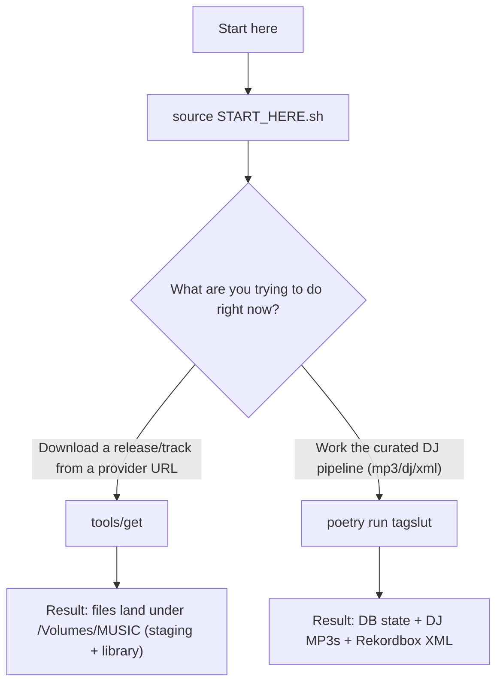
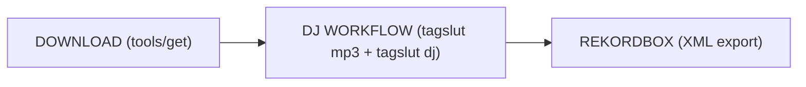

# Command Decision Tree - Which Command Should I Use?

Run `source START_HERE.sh` first to set up your environment (including `$TAGSLUT_DB`, `$MASTER_LIBRARY`, `$DJ_LIBRARY`, and `$STAGING_ROOT`).

**THE SIMPLE RULE:**
- Want to **download** something? → Use `tools/get <url>`
- Want to **do DJ workflow**? → Use `poetry run tagslut <command>`

---

## Command Decision Tree (Flowchart)



---

## Part 1: Downloading Music (Use `tools/get`)

Use `tools/get` when your input is a **provider URL** (Beatport/TIDAL/etc) and you want the system to do the download + promotion workflow.

```bash
# Download a release/track (default pipeline)
tools/get <provider-url>

# Lighter run (skip heavier phases intentionally)
tools/get <provider-url> --no-hoard
```

Notes:
- `tools/get` is the primary downloader wrapper.
- `tools/get --dj` is legacy (deprecated); it is not the curated DJ pipeline.

---

## Part 2: DJ Workflow Commands (Use `poetry run tagslut …`)

Use `poetry run tagslut …` when you are doing **curated DJ library work**: intake/MP3 build/reconcile/admit/validate/export.

Environment (set by `source START_HERE.sh`):
- `$TAGSLUT_DB` points at the FRESH_2026 database: `/Users/georgeskhawam/Projects/tagslut_db/FRESH_2026/music_v3.db`
- `$MASTER_LIBRARY` defaults to `/Volumes/MUSIC/MASTER_LIBRARY`
- `$DJ_LIBRARY` defaults to `/Volumes/MUSIC/DJ_LIBRARY`
- `$STAGING_ROOT` defaults to `/Volumes/MUSIC/mdl`

Canonical 4-stage DJ workflow:

```bash
# Stage 1: Intake masters (creates/refreshes canonical identity state)
poetry run tagslut intake <provider-url>

# Stage 2: Build DJ MP3s from canonical masters (creates MP3s)
poetry run tagslut mp3 build --db "$TAGSLUT_DB" --dj-root "$DJ_LIBRARY" --execute

# Stage 2 alternative: Register existing MP3 root (no re-transcode)
poetry run tagslut mp3 reconcile --db "$TAGSLUT_DB" --mp3-root "$DJ_LIBRARY" --execute

# Stage 3: Admit into curated DJ library
poetry run tagslut dj backfill --db "$TAGSLUT_DB"

# Stage 3 gate: Validate DJ library state
poetry run tagslut dj validate --db "$TAGSLUT_DB"

# Stage 4: Emit Rekordbox XML
poetry run tagslut dj xml emit --db "$TAGSLUT_DB" --out /Volumes/MUSIC/rekordbox_new.xml
```

See `docs/DJ_PIPELINE.md` for the canonical DJ reference.

---

## Part 3: Why Two Command Styles?

`tools/get` is a wrapper built for **day-to-day acquisition** (download + promote + operator-friendly output).

`poetry run tagslut …` is the canonical CLI for **deterministic library state** and the **curated DJ pipeline** (intake / mp3 / dj / xml).

When in doubt:
- If you have a URL and you want files: `tools/get <url>`
- If you are operating on the curated DJ pipeline: `poetry run tagslut …`

---

## Part 4: Quick Reference by Task

```bash
# 1) “I have a Beatport/TIDAL URL and I want it in the library”
tools/get <provider-url>

# 2) “I already have masters, now I need DJ MP3s”
poetry run tagslut mp3 build --db "$TAGSLUT_DB" --dj-root "$DJ_LIBRARY" --execute

# 3) “I already have MP3s on disk, register them (no transcode)”
poetry run tagslut mp3 reconcile --db "$TAGSLUT_DB" --mp3-root "$DJ_LIBRARY" --execute

# 4) “Admit everything into curated DJ layer”
poetry run tagslut dj backfill --db "$TAGSLUT_DB"

# 5) “Validate the DJ library before export”
poetry run tagslut dj validate --db "$TAGSLUT_DB"

# 6) “Export Rekordbox XML to /Volumes/MUSIC”
poetry run tagslut dj xml emit --db "$TAGSLUT_DB" --out /Volumes/MUSIC/rekordbox_new.xml
```

---

## Part 5: The Mental Model



---

## Part 6: When You're Confused (Checklist)

1. Run `source START_HERE.sh`
2. Ask: “Is my input a URL and I want to download?” → run `tools/get <url>`
3. Otherwise: “Am I doing mp3/dj/xml work?” → run `poetry run tagslut …`
4. If a command complains about missing env vars, re-run `source START_HERE.sh` and check:
   - `echo "$TAGSLUT_DB"` (should be the FRESH_2026 DB)
   - `ls /Volumes/MUSIC` (volume mounted)

---

## TL;DR

- Download stuff: `tools/get <url>`
- DJ workflow: `poetry run tagslut mp3 …` / `poetry run tagslut dj …`
- When confused: run `source START_HERE.sh` first, then follow the decision tree
