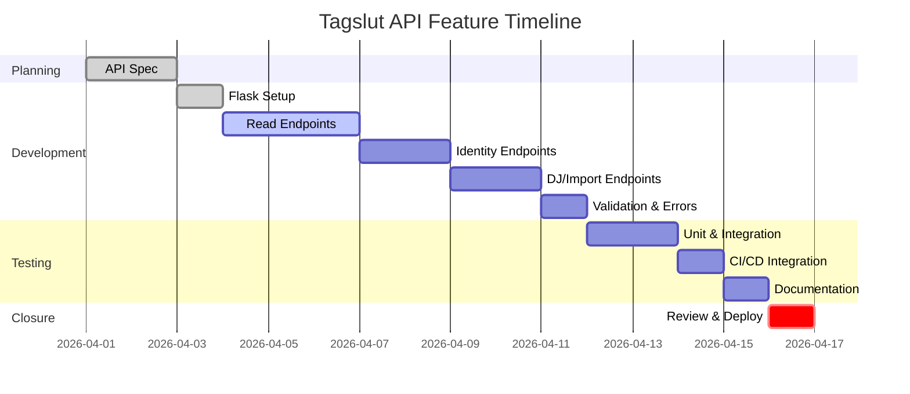

# Executive Summary  
**Tagslut** is a Python 3.11+ music library management and DJ pool orchestration toolkit【70†L51-L54】【39†L8-L16】.  Its code is organized into a Click-based CLI (`tagslut/cli/commands/`), an execution layer (`tagslut/exec`), DJ-specific logic (`tagslut/dj`), and a storage layer (`tagslut/storage/v3`) for the SQLite database【39†L8-L16】【39†L34-L43】.  Core data models include `track_identity` (canonical recording records), `asset_file` (physical file rows), and `asset_link` (association links)【70†L129-L136】.  We propose adding a **RESTful Web API** module (using Flask) to expose Tagslut’s functionality over HTTP. This report reviews the existing architecture, outlines the new API design and interfaces, and details a comprehensive implementation roadmap, including testing, CI/CD, migration, performance and security considerations, plus tasks and timeline.  

# Project Overview & Architecture  
Tagslut’s primary language and stack are given in its documentation: *“Python 3.11+, Poetry, SQLite, Click CLI, Flask optional, FFmpeg, mutagen, rapidfuzz”*【70†L51-L54】.  The CLI entrypoint `tagslut/cli/main.py` registers multiple command groups (intake, index, decide, report, etc.)【30†L17-L26】.  The repository layout (summarized in **REPO_SURFACE.md**) divides code into:  
- **CLI** (`tagslut/cli/commands/`): Click command implementations and help text【30†L17-L26】【39†L8-L16】.  
- **Execution** (`tagslut/exec/`): scripts for transcoding and pipeline steps.  
- **DJ Logic** (`tagslut/dj/`): DJ-specific functions (pool orchestration, XML export).  
- **Storage** (`tagslut/storage/v3/`): database schema, SQLAlchemy models or SQL DDL, and migrations【39†L34-L43】.  
- **Tools/Scripts** (`tools/` and `scripts/dj/`): e.g. the Bash script `tools/get-intake` orchestrates the download and intake pipeline【18†L0-L8】.  

Tagslut’s CLI is *single-user, CLI-driven* (no GUI by default) and is primarily run on macOS with mounted audio volumes【70†L51-L54】. The database (currently SQLite v3, with migrations managed by Alembic) uses a *v3 identity model*. Key tables include `track_identity` (with unique `identity_key`, provider IDs, ISRC, etc.), `asset_file`, and `asset_link`【70†L129-L136】.  For backward compatibility, legacy tables (e.g. `files`, `library_tracks`) mirror old data【70†L129-L136】.  For example, migration *0006* added new columns (`label`, `catalog_number`, etc.) to `track_identity` without dropping legacy tables.  We will preserve these invariants when adding the API.  

# Relevant Code and Data Models  
- **Database Schema:** The v3 schema’s authoritative DDL lives in `tagslut/storage/v3/schema.py`.  Notable v3 tables include:  
  - `asset_file` (file metadata, hashes, zone, format, size, duration, etc.)【70†L129-L136】.  
  - `track_identity` (fields like `identity_key`, `isrc`, `beatport_id`, `artist_norm`, `title_norm`, plus Phase-1 additions `label`, `catalog_number`, `canonical_duration_s`, `merged_into_id`)【70†L129-L136】.  
  - `asset_link` (joins assets to identities with `confidence` and an `active` flag)【70†L129-L136】.  
  - Audit tables: `move_plan`, `move_execution`, `provenance_event` (for intake logging)【70†L129-L136】.  
  - Legacy mirrors: tables `files`, `library_tracks`, `library_track_sources`【70†L129-L136】.  

- **Identity Service:** All writes to `track_identity` must go through the `identity_service` (in `tagslut/storage/v3/identity_service.py`) to enforce consistency【55†L18-L27】.  It resolves or creates identities by ISRC or provider IDs (Beatport/Tidal) and ensures idempotency【55†L38-L47】【55†L49-L58】.  Any new API routes that affect identities should invoke this service to avoid bypassing schema invariants.  

- **CLI Commands:** The CLI is modular; e.g. `tagslut intake`, `tagslut index enrich`, `tagslut report dj` each correspond to functions in `tagslut/cli/commands/*.py`.  For example, the `report` group lives in `tagslut/cli/commands/report.py`【58†L3-L5】. New API endpoints may leverage the same underlying functions (tagging, exporting, etc.) that these commands use.  

- **Environment and Config:** Environment variables configure paths (e.g. `TAGSLUT_DB`, library roots)【16†L24-L33】. The API should respect the same config (e.g. reading `TAGSLUT_DB` or a config file to connect to the database).  

# Proposed Feature Design: REST API Module  

We propose a **Flask-based RESTful API** submodule (e.g. under `tagslut/api/`) that exposes Tagslut’s core data and operations over HTTP.  This enables integration with web UIs or other services. Key design points:  

- **Resource Model:** Align with the data tables. Expose resources as plural nouns (per REST best practices【68†L75-L84】【69†L163-L172】), for example:  
  - `GET /api/tracks` – list tracks (with optional query filters).  
  - `GET /api/tracks/{id}` – get details of a specific track (by internal ID or `identity_key`).  
  - `GET /api/assets/{id}` – get an asset_file record.  
  - `GET /api/identities/{identity_key}` – retrieve a track_identity.  
  - `POST /api/identities` – create or resolve an identity (invoking `resolve_or_create_identity`) with provided metadata (ISRC, artist, title, etc.).  
  - `GET /api/dj/candidates` – fetch DJ candidate tracks (reuse `tagslut/dj` logic).  
  - `POST /api/import` – trigger ingestion of new batch (wrapping `tools/get-intake`).  
  - (Optional) `GET /api/providers` – list supported metadata providers (Tidal, Beatport).  

  All endpoints use JSON for requests and responses (platform-independence)【69†L54-L60】. Use standard HTTP methods: GET for read, POST/PUT/PATCH for writes, DELETE for removals【68†L121-L130】.  

- **Input/Output:**  
  - **JSON Schemas:** Define request and response schemas (could use Pydantic or Marshmallow). Responses include resource fields. Errors return JSON with `error` and use appropriate status codes (e.g. 400 for bad input, 404 for not found)【68†L139-L148】.  
  - **Example:** For `GET /api/tracks`, respond with `[{ "id": 123, "path": "...", "artist": "...", ...}, ...]`. For `GET /api/tracks/123`, respond `{"id": 123, "path": "...", ...}` or 404 if missing.  

- **Endpoints & Interfaces:** Using Flask, endpoints can be implemented as route functions.  For example (pseudocode):  
  ```python
  @app.route("/api/tracks/<int:id>", methods=["GET"])
  def get_track(id):
      track = db.fetch("SELECT * FROM asset_file WHERE id=?", id)
      if not track:
          return ({"error": "Not found"}, 404)
      return jsonify(track)
  ```  
  Complex operations (e.g. identity resolution) can be POSTs that call internal services.  For example:  
  ```python
  @app.route("/api/identities", methods=["POST"])
  def create_identity():
      data = request.get_json()
      id = identity_service.resolve_or_create(data["isrc"], data["artist"], data["title"], data["provider"])
      return {"identity_id": id}, 201
  ```  
  (See design best practices【68†L121-L130】【69†L163-L172】 for naming.)

- **Error Handling:** All endpoints should validate input and return clear JSON errors.  Use HTTP status codes: 400 for validation errors, 404 for missing resources, 500 for server errors【68†L139-L148】.  Flask extensions (e.g. Flask-Smorest) can auto-document error responses.  

- **Security/Privacy:** Initially, the API can be internal or token-protected. Potential concerns: exposing personal or copyrighted metadata. Mitigations include:  
  - Running the API only on localhost or behind auth (e.g. API keys or JWT).  
  - Rate limiting or read-only defaults if needed.  
  - Ensure no writing to final library (`$MASTER_LIBRARY`) unless via safe CLI flows (as per directives【16†L99-L108】). The API should inherit existing RLS (row-level security) policies if using Postgres/Supabase【3†L123-L132】.  

- **Documentation:** Provide OpenAPI (Swagger) spec.  Tools like *flask-smorest* can auto-generate this【73†L3-L11】. This matches the existing Postman SDK (noted in `pyproject.toml`) by producing a JSON spec for client generation.  

# Implementation Plan  

We break the work into phases with milestones:  

1. **API Specification (2d):** Define the OpenAPI schema for all endpoints. Decide request/response models. Review with stakeholders. (Use a tool like Swagger Editor or YAML).  
2. **Project Structure (0.5d):** Create new `tagslut/api/` (or `_api`) directory. Add Flask app bootstrap (`app = Flask(__name__)`). Configure reading of `TAGSLUT_DB`.  
3. **Core Endpoints (3d):** Implement basic resources: *Tracks* and *Asset Files*.  
   - `GET /api/tracks`, `GET /api/tracks/{id}` hooking into `tagslut/storage/v3` data (via SQLAlchemy or raw SQL).  
   - `GET /api/asset_files`.  
   - (Optional) filtering queries, pagination.  
4. **Identity Endpoints (2d):**  
   - `GET /api/identities/{identity_key}`, `POST /api/identities`.  
   - Internally call `identity_service.resolve_or_create_identity()`.  
   - Ensure migrations (`migrate v3`) have run so schema matches code.  
5. **DJ Pipeline Endpoints (2d):**  
   - `GET /api/dj/candidates` to retrieve DJ export (reuse `tagslut/dj` logic).  
   - `POST /api/import` to invoke `tools/get-intake` (or new intake function) on the server. This may involve shelling out or calling underlying functions.  
6. **Integration with CLI Functions (2d):** For operations already implemented in CLI (e.g. tagging/enrichment), invoke those functions (possibly refactor them into importable modules).  
7. **Testing (2d):** Write unit tests for each endpoint (mocking DB as needed). Write integration tests (e.g. using `pytest` and Flask test client).  
8. **CI/CD Setup (1d):** Update GitHub Actions: add a workflow to run API tests. Include style checks and lint (Flake8, MyPy). Possibly build a Docker image.  
9. **Documentation (1d):** Publish OpenAPI spec (e.g. as `openapi.yaml`), update README and docs (e.g. `docs/SCRIPT_SURFACE.md` to mention API).  
10. **Cleanup & Review (1d):** Code review, finalize logging/metrics, update CHANGELOG with the feature.  

**Dependencies:** Database migrations (v3) must be complete before identity endpoints. The existing CLI code should be refactored for reuse.  
**Milestones:**  
- *M1 (Day 2):* API spec drafted.  
- *M2 (Day 5):* Basic read endpoints and identity logic implemented.  
- *M3 (Day 8):* DJ and import endpoints complete.  
- *M4 (Day 9):* Testing passed, CI configured.  
- *M5 (Day 10):* Documentation and go-live.

# Testing Strategy  

- **Unit Tests:** Each endpoint should have unit tests using Flask’s testing client and Pytest.  E.g. test `GET /api/tracks` returns expected JSON, `404` on missing. For identity POST, mock database to test creating vs resolving.  
- **Integration Tests:** Use the same SQLite schema (fresh or test database) to simulate full flows: ingest a track, then fetch via API.  Include error cases (e.g. invalid JSON, bad IDs).  
- **End-to-End:** If possible, run a small Tagslut instance (dev DB) and use tools like Postman/newman to call the API. Validate that CLI tasks (like `tagslut intake` files) reflect in API queries.  
- **CI Tests:** Integrate tests in GitHub Actions (`pytest -x`). Optionally, add coverage threshold.  

# CI/CD and Deployment  

- **Pipeline Changes:** Update existing GitHub Actions or CI to run API tests. If deploying the API separately, add a workflow for building/pushing a Docker container (e.g. to GitHub Container Registry).  
- **Environments:** Provide `tagslut[api]` extras for dependencies (Flask, flask-smorest, etc.). Ensure `pyproject.toml` is updated with any new libraries.  
- **Deployment:** The API could run as a long-lived service. For example, use Gunicorn or uWSGI behind an HTTP proxy. If using Supabase (Postgres) backend in production, adapt connection settings (PSYCOPG is already a dependency【28†L29-L31】).  
- **Backward Compatibility:** Existing CLI commands remain unchanged. The API is an additive feature. If it introduces any DB writes (e.g. identity creation), ensure they respect legacy constraints and do not break scripts. No migrations or DB schema changes should be needed just for the API (unless adding new tables for API keys, which would require a migration).  

# Performance & Scalability  

- **Concurrency:** Flask by itself is single-threaded; for concurrency, run under Gunicorn with multiple workers or use a production WSGI server.  
- **Database Load:** API calls will hit the SQLite/PSQL database. In high-load scenarios, consider PostgreSQL (via Supabase) for better concurrency. Use connection pooling and transactions.  
- **Caching:** If certain resources are read-heavy (e.g. fetching static metadata), consider caching responses.  
- **Pagination:** For list endpoints (e.g. `/api/tracks`), implement limit/offset parameters to avoid huge payloads.  
- **Asynchronous Tasks:** Long-running tasks (e.g. triggering a large intake import) should be asynchronous (return 202 Accepted and perform job in background) to avoid HTTP timeouts.  

# Monitoring & Observability  

- **Logging:** Instrument API endpoints with structured logs (request paths, response codes, errors). Integrate with Tagslut’s logging (it uses `logging.getLogger("tagslut")`【30†L40-L48】).  
- **Metrics:** Expose basic metrics (e.g. request count, latencies) via Prometheus. Use tools like `flask-prometheus` or middleware.  
- **Error Tracking:** Configure error alerts (e.g. Sentry) for unhandled exceptions.  
- **Health Checks:** Provide a `/api/health` endpoint for uptime monitoring.  

# Risks & Mitigations  

| Risk                                | Mitigation                                              |
|-------------------------------------|---------------------------------------------------------|
| **Data Exposure/Security**          | Run API behind auth (API key or OAuth). Filter outputs to non-sensitive fields. Apply RLS policies if using Postgres. |
| **Schema Drift**                    | Ensure the API layer uses the same migrations as CLI. Add integration tests after any DB change. |
| **Backward Compatibility Breaks**   | The API adds new code but does not alter existing CLI contracts. Ensure no CLI behavior changes without deliberate version bump. |
| **Performance Bottleneck**          | Use Gunicorn with multiple workers. Profile endpoints. Throttle or cache as needed. |
| **Complexity/Testing Gaps**         | Maintain high test coverage. Peer-review API routes and docs. |

# Prioritized Task List  

1. **Define OpenAPI Spec:** Draft endpoints, data models, and request/response schemas (2 days).  
2. **Set Up Flask App:** Add `tagslut/api/` module; bootstrap Flask, configure DB access (0.5d).  
3. **Implement Read Endpoints:** `GET /api/tracks`, `/assets`, etc., using existing ORM/SQL (3d).  
4. **Implement Identity Routes:** `/api/identities` (GET, POST) invoking identity_service (2d).  
5. **Implement DJ/Import Routes:** DJ candidates export, batch import trigger (2d).  
6. **Input Validation & Error Handling:** Use schemas (Pydantic/Marshmallow) to validate and document requests (1d).  
7. **Testing & CI:** Write unit/integration tests for API, integrate into CI pipeline (2d).  
8. **Documentation:** Publish Swagger/OpenAPI spec, update README and docs (1d).  
9. **Final Review:** Code cleanup, performance tuning, logging, deploy trial (1d).  

# Timeline  



# Design Alternatives  

| Aspect                   | Option A: Flask REST (Current Plan)                               | Option B: FastAPI/GraphQL                   | Option C: CLI Extensions Only              |
|--------------------------|------------------------------------------------------------------|---------------------------------------------|-------------------------------------------|
| **Development Effort**   | Medium (Flask familiar, minimal async)                           | Higher (async, learning curve with Pydantic)| Low (reuse CLI)                           |
| **Performance**          | Good for typical loads with Gunicorn【71†L5-L8】, synchronous    | Potentially higher concurrency (async)【71†L5-L8】 | N/A (no network overhead)                 |
| **Features**             | Mature ecosystem, easy Swagger/OpenAPI (flask-smorest)【73†L3-L11】  | Automatic docs, data validation (FastAPI)  | Only CLI interface (no remote access)     |
| **Complexity**           | Moderate (manage Flask app, maintain endpoints)                  | Higher (async, GraphQL schema complexity)   | Simple, but sacrifices integration        |
| **Monitoring/Scaling**   | Can use WSGI containers (Gunicorn), existing logging            | Similar (requires ASGI server like Uvicorn) | CLI only, scaling via cron or scripts     |

# Code Sketch  

Below is a pseudocode sketch of core API routes using Flask (for illustration):  

```python
from flask import Flask, request, jsonify
from tagslut.storage.v3.identity_service import resolve_or_create_identity

app = Flask(__name__)

@app.route("/api/tracks", methods=["GET"])
def list_tracks():
    # Example: fetch list from database
    rows = db.execute("SELECT id, path, artist, title FROM asset_file").fetchall()
    return jsonify([dict(row) for row in rows])

@app.route("/api/tracks/<int:track_id>", methods=["GET"])
def get_track(track_id):
    row = db.execute("SELECT * FROM asset_file WHERE id=?", (track_id,)).fetchone()
    if not row:
        return jsonify({"error": "Not found"}), 404
    return jsonify(dict(row))

@app.route("/api/identities", methods=["POST"])
def post_identity():
    data = request.json
    # Expected fields: isrc, beatport_id, tidal_id, artist, title, etc.
    identity_id = resolve_or_create_identity(
        conn=db_conn,
        asset_row=None,       # if new asset is being linked
        metadata=data,
        provenance=data.get("provenance", "api")
    )
    return jsonify({"identity_id": identity_id}), 201

@app.route("/api/identities/<identity_key>", methods=["GET"])
def get_identity(identity_key):
    row = db.execute("SELECT * FROM track_identity WHERE identity_key=?", (identity_key,)).fetchone()
    if not row:
        return jsonify({"error": "Identity not found"}), 404
    return jsonify(dict(row))
```

Each route includes parameter handling and error responses. Documentation strings or decorators (not shown) would hook into an OpenAPI spec generator (e.g. **flask-smorest**【73†L3-L11】).  

By following these designs and plans, we can integrate a robust web API into Tagslut without disrupting existing CLI workflows. All implementation should reference existing schemas and services (e.g. the identity service) to maintain consistency【55†L40-L49】【70†L129-L136】.  

**Sources:** Tagslut repo code and docs【30†L17-L26】【39†L34-L43】【70†L51-L54】【70†L129-L136】; REST API design best practices【68†L121-L130】【69†L163-L172】【73†L3-L11】.
