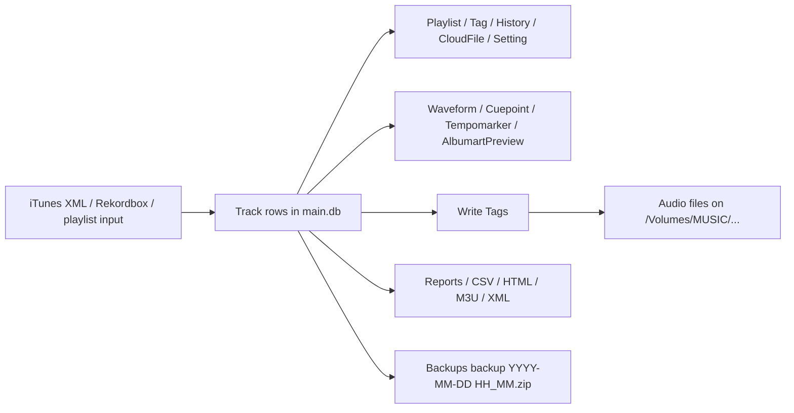

# Lexicon Metadata Report
_Read-only inspection of `/Users/georgeskhawam/Documents/Lexicon`_

## Executive Summary
- Fact: The only database found here is a set of 15 zipped snapshots in `Backups`, each containing a single `main.db`.
- Fact: The latest snapshot checked is `backup 2026-04-17 14_31.zip`; it has 73,310 `Track` rows and 26 `Playlist` rows.
- Fact: The earliest snapshot checked is `backup 2026-04-05 23_31.zip`; it has 65,457 `Track` rows and 80 `Playlist` rows.
- Inference: `main.db` is the authoritative Lexicon state, while reports, playlists, HTML/CSV/XML exports, and backups are derived outputs or historical snapshots.
- Fact: No audio files live inside this directory; every audio path referenced by the DB points outside, mostly under `/Volumes/MUSIC/...`.

## Directory Map

| Path | Count | Observed role |
|---|---:|---|
| `Backups/` | 15 ZIPs | Timestamped `backup YYYY-MM-DD HH_MM.zip` snapshots, each containing only `main.db`. |
| `Reports/` | 79 TXT files | One run log per job/date, mostly `Find Tags`, `Write Tags`, `Moved Tracks`, `Find Duplicates`, `Find Lost Tracks`, `Cloud Storage Upload`, `Send To Spotify`, and `Archive`. |
| Root exports | 57 files | Playlist manifests, CSV/JSON/XML/HTML exports, and standalone text summaries. |

### Root export patterns

| Pattern | Likely job/output type |
|---|---|
| `dj_pool_decisions_YYYYMMDD_HHMMSS.csv/json` | Playlist curation decision table; includes policy path and in/out/review counts. |
| `dj_pool_in/out/review_YYYYMMDD_HHMMSS.m3u8` | Partitioned playlists from the curation job. |
| `kalabrese_*_YYYYMMDD_HHMMSS.*` | Cleanup/quarantine/deletion job outputs. |
| `missing_*`, `needs_tagging_*`, `lexicon_excluded_*` | Tag/completeness review playlists. |
| `Duplicate Tracks YYYY-MM-DD*.txt` | Duplicate-track summaries. |
| `original_itunes.xml`, `edited_itunes.xml` | Before/after iTunes library exports; `edited` is derived. |
| `tagged_lexicon*.csv/html`, `nos.csv/html` | Tabular review/export snapshots. |
| `Dump.html`, `Lexicon_tagged_tracks.html`, `Untitled Intelligent List.html` | Lexicon-generated HTML tables. |
| `00.m3u8` .. `08.m3u8`, `done.m3u8` | Playlist bucket exports with `#EXTINF` metadata or path-only entries. |

## DB / Schema Map

### What the DB stores

| Data class | Main columns | Meaning |
|---|---|---|
| Provenance and identity | `id`, `location`, `locationUnique`, `importSource`, `data`, `fingerprint` | Absolute file path, normalized unique path, import source, source-specific payload, and dedupe fingerprint. |
| Descriptive tags | `title`, `artist`, `albumTitle`, `genre`, `label`, `comment`, `grouping`, `composer`, `producer`, `lyricist`, `remixer`, `year`, `trackNumber` | Music/tag metadata that later gets written back to files. |
| Musical analysis | `bpm`, `key`, `energy`, `danceability`, `popularity`, `happiness` | DJ-oriented analysis values. |
| File/audio properties | `duration`, `bitrate`, `sampleRate`, `sizeBytes` | Physical file/audio characteristics. |
| Workflow state | `playCount`, `lastPlayed`, `rating`, `archived`, `incoming`, `beatshiftCase` | Library state and curation flags. |
| Supporting records | `Playlist`, `Tag`, `History*`, `Waveform`, `Cuepoint`, `Tempomarker`, `AlbumartPreview`, `CloudFile`, `Setting` | Structure, cache, sync, and configuration data. |

`Track.data` carries source provenance. In this snapshot:
- `importSource='7'` rows carry `{"itunes":{"trackId":...}}`
- `importSource='-1'` rows carry `{"rekordbox":{"trackId":...,"kind":"MP3 File","discNumber":"0"}}`
- `importSource='1'` rows have no payload JSON

### Table inventory

| Table | Rows | Notes |
|---|---:|---|
| `Database` | 1 | Schema version `21`, stable UUID `d3c499d8f4d241e8994d826237490032`. |
| `Track` | 73,310 | Canonical track record. |
| `Playlist` | 26 | Playlist definitions; `smartlist` JSON stores rule logic. |
| `LinkTrackPlaylist` | 38,642 | Playlist membership and ordering. |
| `TagCategory` | 6 | Tag groups (`Genre`, `Untitled Column`, `Mood`, `Timing`, `Components`, `Situation`). |
| `Tag` | 80 | Tag values, mostly genre labels. |
| `LinkTagTrack` | 0 | Tag-link table exists but is empty in this snapshot. |
| `HistorySession` | 22 | Play history session headers. |
| `HistoryTrack` | 136 | Denormalized historical snapshots of track metadata. |
| `Waveform` | 17,001 | Waveform cache. |
| `Tempomarker` | 18,589 | Tempo marker cache. |
| `Cuepoint` | 8 | Cue/loop marker records. |
| `AlbumartPreview` | 24,171 | Cached album-art previews. |
| `CloudFile` | 57 | Cloud upload/sync ledger. |
| `Setting` | 210 | App configuration and workflow state. |
| `Track_FTS` | 73,310 | Full-text index over `title`, `artist`, `albumTitle`. |
| `Track_FTS_config` / `data` / `docsize` / `idx` | internal | FTS shadow tables. |
| `ChartItem` | 0 | Present but empty. |

### Key indexes, triggers, and foreign keys

- `Track` is heavily indexed on user-facing fields: `title`, `artist`, `albumTitle`, `location`, `genre`, `key`, `bpm`, `year`, `playCount`, `rating`, `lastPlayed`, `dateAdded`, `dateModified`, `duration`, `bitrate`, `sampleRate`, `sizeBytes`, and more.
- `Track.locationUnique` is unique and acts as the normalized path key.
- `Track` also has a unique `(streamingService, streamingId)` index.
- `Track_FTS` is maintained by insert/update/delete triggers on `Track`.
- `LinkTrackPlaylist` has FKs to `Track.id` and `Playlist.id`, plus a unique `(trackId, playlistId)` constraint.
- `Playlist.parentId` is a self-FK, so playlists form a hierarchy.
- `Tag.categoryId` links to `TagCategory.id`.
- `Waveform`, `Tempomarker`, `Cuepoint`, and `AlbumartPreview` all link back to `Track.id`.
- `HistoryTrack.historyId` links to `HistorySession.id`.
- `CloudFile` has indexes on `trackId`, `cloudId`, `locationUnique`, and `state`, but no explicit FK.
- `CloudFile` state distribution is 54 rows with `state=1` and 3 rows with `state=2`; 3 rows have null `locationUnique` and `cloudId`.

## Metadata Lifecycle Map

| Stage | Fact | Inference / source of truth |
|---|---|---|
| Import | `original_itunes.xml` and `edited_itunes.xml` are iTunes exports; `Track.data` stores source IDs from iTunes or Rekordbox. | Metadata first appears from external library exports/imports, then gets normalized into `Track`. |
| Normalize | `Track.locationUnique` is the normalized path key; `Playlist.smartlist` stores query rules as JSON. | `Track` is the canonical row model inside Lexicon. |
| Enrich | `Find Tags` logs show fields being added or updated; `Waveform`, `Cuepoint`, `Tempomarker`, and `AlbumartPreview` store analysis/cache artifacts. | The DB is enriched before file writeback; derived caches are not the source of truth. |
| Write back | `Write Tags` logs show selected fields being written; `TagWriter` enables fields such as artist, albumTitle, bpm, genre, label, key, year, and others. | File tags become the persistent on-disk mirror of selected `Track` fields. |
| Move/rename | `MoveFiles.renamePatternCustom` is `%artist% - {(%year%)} %albumTitle% - %trackNumber%. %title%`; `Moved Tracks` logs show successful and failed relocations. | The filesystem path is derived from DB metadata and move rules. |
| Export/share | `tagged_lexicon_compare.csv` compares `lex_*`, `file_*`, and `db_*`; HTML/CSV/M3U/XML files are generated for review and sharing. | Reports and exports are downstream views, not authoritative state. |
| Sync/backup | `CloudFile` tracks uploads; `Backups/*.zip` snapshot `main.db`; `Setting` stores backup/sync timestamps. | Backups preserve point-in-time DB state, not a separate live dataset. |

### Concrete evidence files
- `Reports/Find Tags 2026-04-17.txt`
- `Reports/Write Tags 2026-04-17.txt`
- `Reports/Moved Tracks 2026-04-17.txt`
- `Reports/Cloud Storage Upload 2026-04-17.txt`
- `Reports/Send To Spotify 2026-04-16.txt`
- `tagged_lexicon_compare.csv`
- `original_itunes.xml`
- `edited_itunes.xml`
- `dj_pool_decisions_20260226_214638.json`
- `kalabrese_deleted_summary_20260226_211737.json`

## Risks / Ambiguities
- `importSource` numeric meanings are inferred from payload contents, not documented here.
- `CloudFile.state` values `1` and `2` are visible, but their semantic labels are not confirmed.
- `LinkTagTrack` is empty, so relational tag assignment may be unused or stale in this snapshot.
- `CloudFile` has no explicit FK to `Track`, so orphaned sync rows are possible.
- `00.m3u8` .. `08.m3u8` and `nos.*` are structurally clear exports, but their semantic labels are not visible from filenames alone.
- `edited_itunes.xml` is clearly derived from `original_itunes.xml`, but the exact generation step is not confirmed.
- The playlist count drops from 80 to 26 between the earliest and latest snapshots; whether that reflects cleanup, rebuild, or filtering is not visible from the files alone.

## Recommended Next Investigation Steps
- Confirm the numeric mapping for `importSource` and `CloudFile.state`.
- Confirm whether `Track` or embedded file tags are the final source of truth after `Write Tags`.
- Confirm what `00.m3u8` .. `08.m3u8`, `nos.*`, and `done.m3u8` represent in the workflow.
- Confirm whether `LinkTagTrack` is intentionally unused or should be populated.
- Confirm the exact transform that produced `edited_itunes.xml` from `original_itunes.xml`.
